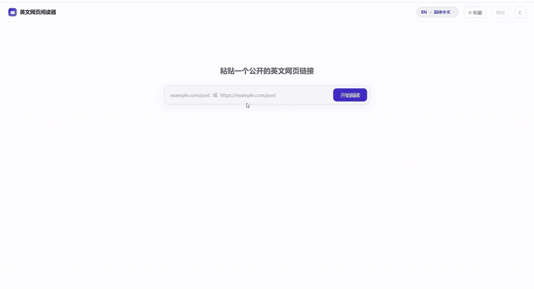

# English Web Reader

**Read English web pages bilingually.** Paste a URL, get a clean two-column reading view — original on the left, translation on the right, aligned block by block in real time.



---

## Getting started

Requires **Node 22+**.

### 1. Backend

```bash
cd server
npm install
cp .env.example .env        # then set LLM_API_KEY
npm run build
npm start                   # http://localhost:3000
```

### 2. Frontend

```bash
cd web
npm install
npm run dev                 # http://localhost:5173
```

### Configuration

All backend configuration lives in `server/.env`. The upstream is addressed with **vendor-neutral names** on purpose — switching providers means changing values, not code:

| Variable | Required | Default | Notes |
| --- | --- | --- | --- |
| `PORT` | no | `3000` | Injected by the deploy sandbox in production |
| `LLM_API_KEY` | **yes** | — | Server-side only; never reaches the frontend, logs or error messages |
| `LLM_BASE_URL` | no | `https://open.bigmodel.cn/api/paas/v4` | The trailing `/v4` is required — the client appends `/chat/completions` |
| `LLM_MODEL` | no | `glm-4-flash` | Upstream model names change without changelog entries; check the provider's docs |
| `LLM_TIMEOUT_MS` | no | `30000` | Per-block timeout |

Without a key the translation endpoint refuses at the door; fetching, reading and exporting keep working.

> Both packages ship an `.npmrc` pointing at a China-based npm mirror. Delete those two files if you're building from outside China.

## Testing

Testing is split into three layers on purpose, each answering a different question:

```bash
# 1. Offline logic — fast, no network, no LLM quota
cd server && npm test        # 197 checks
cd web    && npm test        # 114 checks

# 2. Real network, real articles — "does the whole chain actually work"
cd server && npm run smoke             # fetch / extract / language / SSRF, 16 checks
cd server && npm run verify:translate  # end-to-end translation, 47 checks

# 3. Real rendering — "does the page actually look right"
cd web && npm run shot                 # 4 scenarios, screenshots + DOM assertions
```

The integration scripts run against a **local mock upstream** (`server/scripts/mock-llm.mjs`) rather than a live provider, so they are deterministic, offline, and free. The mock turns phrases into triggers (`__429__`, `__500__`, `__SLOW__`, …) so error paths can be asserted too.

`npm run shot` drives a headless Chrome over the DevTools Protocol: it starts both services, waits for translation to actually settle, then asserts alignment, the shared-block layout, the export round-trip and preference persistence. It is the only layer that can catch "the data is right but the page is wrong".

## Known limitations

- **Translation quality has not been evaluated by a human yet.** The pipeline is verified; the output is not.
- **Landing and category pages extract poorly.** The pipeline handles articles and documentation well, but a site's front page tends to come out as a short, plausible-looking fake article. A field probe of 72 real sites put success at 32/72, with the misses dominated by network reachability and anti-bot responses rather than extraction — and the poor results clustered on page *type*, not on site.
- **What the server can fetch depends on where it runs.** The probe was run from a mainland-China host, where most international news sites are unreachable. Re-run it from wherever you deploy.

## License

No license has been chosen yet. Until one is, the code is under default copyright — please open an issue rather than assume permission.
